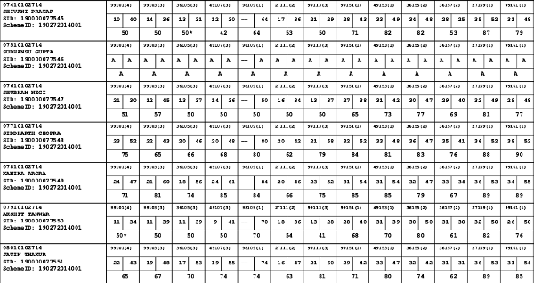
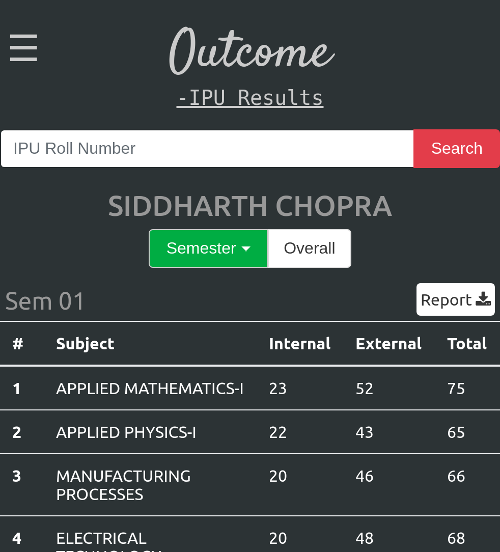
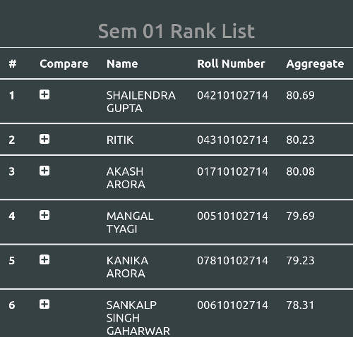

# Outcome for IPU

A single page [web app](https://outcome-ipu.herokuapp.com) that provides results to IP University students in a tabular form and also displays the class ranks, university ranks, aggregate result summary of the student. One can also download their individual result in a PDF form and use it when offline. All it needs is the student's Roll Number and it fetches all the results available in the database.  
  
####Please read the features close issue in the issues tab!  
  
### From

### To
Result             |  Rank List
:-------------------------:|:-------------------------:
  |  

### Features
1. Results of all CSE, IT, ECE, EEE, MAE students starting from 2014 Batch, some results are also available for 2013 batch.
2. Mobile friendly, using Bootstrap v4.
3. Chrome add to home screen feature and theme color for Chrome on Android.
4. Now added downloadable reports, view your result when offline!
5. Credit percentage 
6. Comparison tables of students in a class.

### Stack
##### 1. Backend
	- Node.js for parsing.
	- Express for serving files.
	- MongoDB for storing data. 

##### 2. Frontend
	- Bootstrap.
	- Vanilla Javascript.
	- Some external libs for report generation and saving.

### Version 1.2
Added downloadable reports and slight front end redesign.

### Bug Watchers
[Vibhor Agrawal](https://github.com/vibhor1997a) - PDF reports aggregate problem.  
[Nikhil Yadav](https://github.com/sam1803) - PDF parsing.

### Contributors
[Manika Shrivastava](https://about.me/manikashrivastava) - Analytics support, feature/layout suggestions and many B.Tech result PDFs.  
[Natasha Malik](https://github.com/NatashaMalik-50) - All MCA result PDFs.  
Raghav Sharma - Link sharing and awareness creation for the project.  

### Updating Reappear Results  
The site currently doesn't support automatic updating of reappear results. However we can manually update them accordingly if you leave a comment on this [issue](https://github.com/Sid-2D/Outcome-IPU/issues/10).

### Note

* The parsers support parsing of any IPU Result of any course, so raise an issue if you want your course result to be displayed here.
* Works best on Chrome and Firefox.
